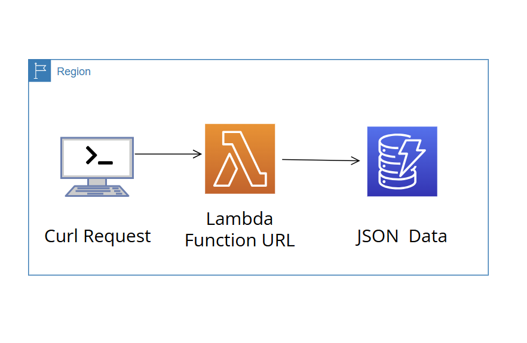

# Cloud API with AWS Lambda and DynamoDB

This project sets up a Lambda function that reads data from an AWS DynamoDB table and returns it as a JSON response via a Lambda function URL. The project is managed using Terraform and includes CI/CD pipelines configured with GitHub Actions to automate python lambda function updates.

## Table of Contents
1. [Project Overview](#project-overview)
2. [Tools](#tools)
3. [Project Structure](#project-structure)
4. [Improvements](#improvements)

## Project Overview

- **AWS Lambda**: A function that queries data from a DynamoDB table and returns it as a JSON response.
- **DynamoDB**: A table (`cloud-api-db`) storing the data that the Lambda function queries.
- **CI/CD**: Continuous Integration and Continuous Deployment pipelines configured with GitHub Actions to automate the deployment and testing of the Lambda function.



## Tools
- **AWS Account** with programmatic access.
- **Terraform** (v1.0 or higher).
- **AWS CLI** configured with the necessary permissions.
- **Python 3.12** or compatible Python runtime.

### Key Terraform Resources
- `aws_dynamodb_table`: Creates the DynamoDB table.
- `aws_iam_role` & `aws_iam_policy`: Define permissions for the Lambda function.
- `aws_lambda_function`: Deploys the Lambda function.
- `aws_lambda_function_url`: Exposes the Lambda function with a publicly accessible URL.

## Testing the Lambda Function
To test the Lambda function, use a `curl` command or a tool like Postman:

```bash
curl -X GET https://pmoi4ik4q3mqnhaz2nmkrcazaq0pgwlp.lambda-url.us-east-1.on.aws/
```

If everything is set up correctly, this should return the JSON data from the DynamoDB table.

## Project Structure
- **`main.tf`**: Contains all Terraform resources to deploy the Lambda function, DynamoDB table, and IAM policies.
- **`variables.tf`**: Defines project-specific variables, including the DynamoDB table name and region.
- **`lambda_function.py`**: The Lambda function code for querying DynamoDB and returning the JSON response.
- **`outputs.tf`**: Outputs the Lambda Function URL after deployment.
- **`data`**: (Optional) Contains the data to be uploaded to DynamoDB in JSON format.

## Improvements

- Limit IAM permissions to specific resources.
- Enable CloudWatch logging for Lambda and DynamoDB.
